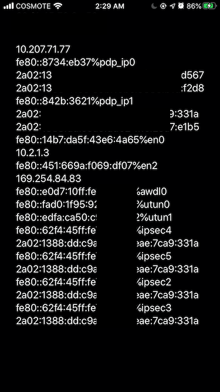

+++
categories = ["programming", "ios", "mac address", "swift"]
date = 2020-02-10T18:21:10Z
description = ""
draft = false
images = ["images/image-4.png", "images/image-6.png","images/image-7.png"]
slug = "get-mac-address-for-ios"
tags = ["programming", "ios", "mac address", "swift"]
title = "Getting an iOS device MAC Address with Swift"
aliases = ["/get-mac-address-for-ios"]

+++


Both Android and iOS don't allow applications to get the MAC address using their published API. Here, we will see if we can avoid this restriction and get the address using a feature of IPv6.

## What is a MAC Address

A MAC address, or physical address, is a 48-bit number that uniquely identifies a device in a network segment. This number is assigned to the device by the manufacturer and usually doesn't change (but it can be spoofed). Almost every common networking device has a MAC address. As a rule of thumb, if your device connects to a network using Ethernet or WiFi, it has a MAC address.

A MAC address looks like this

```
01:23:45:67:89:AB
```

Because this address is unique, many applications have used it to identify and track users. And tracking can continue as long as the user doesn't change device.

## What is a Link-local address

A link-local address is a network address that, in a similar fashion with MAC address, is valid for communications within a network segment. This type of address is mostly used in IPv6. When a network interface has IPv6 enabled, system will automatically create a link-local address for this interface.

In the link below, you can find more details about link-local addresses and IPv6 that are outside of the scope of this post.

<blockquote class="wp-embedded-content"><a href="https://blogs.infoblox.com/ipv6-coe/fe80-1-is-a-perfectly-valid-ipv6-default-gateway-address/">FE80::1 is a Perfectly Valid IPv6 Default Gateway Address</a></blockquote>
<script type='text/javascript'>
<!--//--><![CDATA[//><!--
		!function(a,b){"use strict";function c(){if(!e){e=!0;var a,c,d,f,g=-1!==navigator.appVersion.indexOf("MSIE 10"),h=!!navigator.userAgent.match(/Trident.*rv:11\./),i=b.querySelectorAll("iframe.wp-embedded-content");for(c=0;c<i.length;c++){if(d=i[c],!d.getAttribute("data-secret"))f=Math.random().toString(36).substr(2,10),d.src+="#?secret="+f,d.setAttribute("data-secret",f);if(g||h)a=d.cloneNode(!0),a.removeAttribute("security"),d.parentNode.replaceChild(a,d)}}}var d=!1,e=!1;if(b.querySelector)if(a.addEventListener)d=!0;if(a.wp=a.wp||{},!a.wp.receiveEmbedMessage)if(a.wp.receiveEmbedMessage=function(c){var d=c.data;if(d)if(d.secret||d.message||d.value)if(!/[^a-zA-Z0-9]/.test(d.secret)){var e,f,g,h,i,j=b.querySelectorAll('iframe[data-secret="'+d.secret+'"]'),k=b.querySelectorAll('blockquote[data-secret="'+d.secret+'"]');for(e=0;e<k.length;e++)k[e].style.display="none";for(e=0;e<j.length;e++)if(f=j[e],c.source===f.contentWindow){if(f.removeAttribute("style"),"height"===d.message){if(g=parseInt(d.value,10),g>1e3)g=1e3;else if(~~g<200)g=200;f.height=g}if("link"===d.message)if(h=b.createElement("a"),i=b.createElement("a"),h.href=f.getAttribute("src"),i.href=d.value,i.host===h.host)if(b.activeElement===f)a.top.location.href=d.value}else;}},d)a.addEventListener("message",a.wp.receiveEmbedMessage,!1),b.addEventListener("DOMContentLoaded",c,!1),a.addEventListener("load",c,!1)}(window,document);
//--><!]]>
</script><iframe sandbox="allow-scripts" security="restricted" src="https://blogs.infoblox.com/ipv6-coe/fe80-1-is-a-perfectly-valid-ipv6-default-gateway-address/embed/" width="600" height="338" title="&#8220;FE80::1 is a Perfectly Valid IPv6 Default Gateway Address&#8221; &#8212; Infoblox Blog" frameborder="0" marginwidth="0" marginheight="0" scrolling="no" class="wp-embedded-content"></iframe>


There are many ways that you can create this address, but today we will focus on the SLAAC EUI-64.

IPv6 addresses consist of 128 bits. The first 64 bits are the routing part (the 48 bits for the routing prefix and 16 for the subnet) and the last 64 are the node part and look like this

```
2a00:1450:4001:0820:0000:0000:0000:2003

2a00:1450:4001:0820 | 0000:0000:0000:2003
     Routing part   |      Node part
```

In a link-local address, the routing part is always `FE80:0000:0000:0000`. The EUI-64 is used to generate the node part.

### EUI-64 from MAC address

The procedure to generate the EUI-64 is easy and is done in two steps. First, because MAC is 48 bits, we need to add 16 bits, by adding `FF:FE` in the middle. So, the MAC `01:23:45:67:89:AB` will become `01:23:45:FF:FE:67:89:AB`.

The second step is to flip the 7th bit of the first byte of the address. In our case, the first byte is the group `01` and is represented in binary as `00000001`. After flipping the 7th bit, the byte becomes `00000011` and in hex `03`.

So the **resulting** EUI-64 from the MAC address `01:23:45:67:89:AB` is `03:23:45:FF:FE:67:89:AB`.

The link local address for this machine is `FE80:0000:0000:0000:0323:45FF:FE67:89AB` or in short version `FE80::323:45FF:FE67:89AB`.

You can use this online converter that also provides an HTTP API.

<blockquote class="wp-embedded-content"><a href="https://ben.akrin.com/?p=1347">MAC address to IPv6 link-local address online converter</a></blockquote>
<script type='text/javascript'>
<!--//--><![CDATA[//><!--
		!function(a,b){"use strict";function c(){if(!e){e=!0;var a,c,d,f,g=-1!==navigator.appVersion.indexOf("MSIE 10"),h=!!navigator.userAgent.match(/Trident.*rv:11\./),i=b.querySelectorAll("iframe.wp-embedded-content");for(c=0;c<i.length;c++){if(d=i[c],!d.getAttribute("data-secret"))f=Math.random().toString(36).substr(2,10),d.src+="#?secret="+f,d.setAttribute("data-secret",f);if(g||h)a=d.cloneNode(!0),a.removeAttribute("security"),d.parentNode.replaceChild(a,d)}}}var d=!1,e=!1;if(b.querySelector)if(a.addEventListener)d=!0;if(a.wp=a.wp||{},!a.wp.receiveEmbedMessage)if(a.wp.receiveEmbedMessage=function(c){var d=c.data;if(d.secret||d.message||d.value)if(!/[^a-zA-Z0-9]/.test(d.secret)){var e,f,g,h,i,j=b.querySelectorAll('iframe[data-secret="'+d.secret+'"]'),k=b.querySelectorAll('blockquote[data-secret="'+d.secret+'"]');for(e=0;e<k.length;e++)k[e].style.display="none";for(e=0;e<j.length;e++)if(f=j[e],c.source===f.contentWindow){if(f.removeAttribute("style"),"height"===d.message){if(g=parseInt(d.value,10),g>1e3)g=1e3;else if(~~g<200)g=200;f.height=g}if("link"===d.message)if(h=b.createElement("a"),i=b.createElement("a"),h.href=f.getAttribute("src"),i.href=d.value,i.host===h.host)if(b.activeElement===f)a.top.location.href=d.value}else;}},d)a.addEventListener("message",a.wp.receiveEmbedMessage,!1),b.addEventListener("DOMContentLoaded",c,!1),a.addEventListener("load",c,!1)}(window,document);
//--><!]]>
</script><iframe sandbox="allow-scripts" security="restricted" src="https://ben.akrin.com/?p=1347&#038;embed=true" width="600" height="338" title="&#8220;MAC address to IPv6 link-local address online converter&#8221; &#8212; Ben&#039;s blog" frameborder="0" marginwidth="0" marginheight="0" scrolling="no" class="wp-embedded-content"></iframe>

## How it works

Now that we briefly described the core concepts we can proceed to the main topic.

I wanted, for a project, to read some sensor values with an ESP and broadcast them in the network for Android devices to read. The Android application can't change but the ESP code can. To assign a sensor to a device, without inventing or implementing a complex server-client protocol, we need a way to uniquely identify the client devices. That's why MAC address was considered. It's unique for each device (at least in our case where 4-5 devices will be deployed in the same network), it's permanent and can be obtained just by navigating to the settings.

The only thing that needs to be done is to flash the ESP with the proper firmware that has the correct pair of sensor address-client MAC address. So in each packet, the MAC address of the destination is added and each device has to know their own MAC, keep the correct messages and discard the rest.

Unique device identifiers, generated from the API of the OS, didn't fit our purpose because we wanted to leave the ESP devices off-site and in case the identifier of an Android device changed, we would need to flash the ESPs again.

I quickly realized that getting directly the MAC address of the device is restricted. Both on iOS and Android you can see that

> _In iOS 7 and later, if you ask for the MAC address of an iOS device, the system returns the value `02:00:00:00:00:00`. If you need to identify the device, use the `[identifierForVendor](https://developer.apple.com/documentation/uikit/uidevice/1620059-identifierforvendor)` property of `UIDevice` instead. (Apps that need an identifier for their own advertising purposes should consider using the `[advertisingIdentifier](https://developer.apple.com/documentation/adsupport/asidentifiermanager/1614151-advertisingidentifier)` property of `ASIdentifierManager` instead.) - [iOS 7 Documentation Guide](https://developer.apple.com/library/archive/releasenotes/General/WhatsNewIniOS/Articles/iOS7.html#//apple_ref/doc/uid/TP40013162-SW34)_

> _To provide users with greater data protection, starting in this release, Android removes programmatic access to the device’s local hardware identifier for apps using the Wi-Fi and Bluetooth APIs. The `[WifiInfo.getMacAddress()](https://developer.android.com/reference/android/net/wifi/WifiInfo.html#getMacAddress())` and the `[BluetoothAdapter.getAddress()](https://developer.android.com/reference/android/bluetooth/BluetoothAdapter.html#getAddress())` methods now return a constant value of `02:00:00:00:00:00`. - [Android 6.0 Changes](https://developer.android.com/about/versions/marshmallow/android-6.0-changes.html#behavior-hardware-id)_

I'm going to focus this post on iOS only, although I initially tried this idea on an Oculus Go running a Unity application.

At first, to test if I can get anything out of it, I wrote (with the help of StackOverflow of course!) a simple application that reads all the interfaces it can on my iPhone and displays all their addresses.


<!--  -->

I was disappointed because I didn't see anything worthy for the interface `en0`, the name of the WiFi interface. The link-local address looks like a random address.

But then I noticed there are many IPSec interfaces that have link-local addresses generated with EUI-64! All of them have the same address (which is normal, considering how this address is generated), and the only thing we need to do is to find an IPSec interface and perform the steps of generating an EUI-64 in reverse order to get our MAC Address.

```Swift
    func GetMACAddressFromIPv6(ip: String) -> String{
        let IPStruct = IPv6Address(ip)
        if(IPStruct == nil){
            return ""
        }
        let extractedMAC = [
            (IPStruct?.rawValue[8])! ^ 0b00000010,
            IPStruct?.rawValue[9],
            IPStruct?.rawValue[10],
            IPStruct?.rawValue[13],
            IPStruct?.rawValue[14],
            IPStruct?.rawValue[15]
        ]
        return String(format: "%02x:%02x:%02x:%02x:%02x:%02x", 
            extractedMAC[0] ?? 00,
            extractedMAC[1] ?? 00,
            extractedMAC[2] ?? 00,
            extractedMAC[3] ?? 00,
            extractedMAC[4] ?? 00,
            extractedMAC[5] ?? 00)
    }
```

We create an IPv6Address struct with the given IP as a string.The `rawValue`of the address returns an array with length 16 that represents the address in bytes. So, we flip the second bit of the first byte (position 8 in our array) with a XOR `^` operation (XOR returns 1 only if the two values are different). We also completely ignore the `FF:FE` sequence found at index 11 and 12.

As we can see, the MAC address fetched is the correct one






I searched on Google when and how these IPSec interfaces appear on iOS but without much success. I tried to see the list of my addresses with _Airplane mode_ on and I could still get an `ipsec0` interface, which means you can still get your MAC address even if you are offline.

I'm curious to learn if Apple will approve an application with this functionality in the App Store, but unfortunately I don't have a developer account.

Later, I remembered that an application that shows the interfaces of your devices exist and I have already installed it. It's called [_HE.NET Network Tools._](https://apps.apple.com/us/app/he-net-network-tools/id858241710) You can use that to see your interfaces to verify that the IPSec link-local address is based on your MAC address in case you can't compile and run the application I wrote.

If you managed to do something similar for Android, let me know! (mostly because I tried and failed on devices different than the Oculus Go)

The source of this project can be found [here](https://github.com/spanagiot/iOS-Mac-Address).

